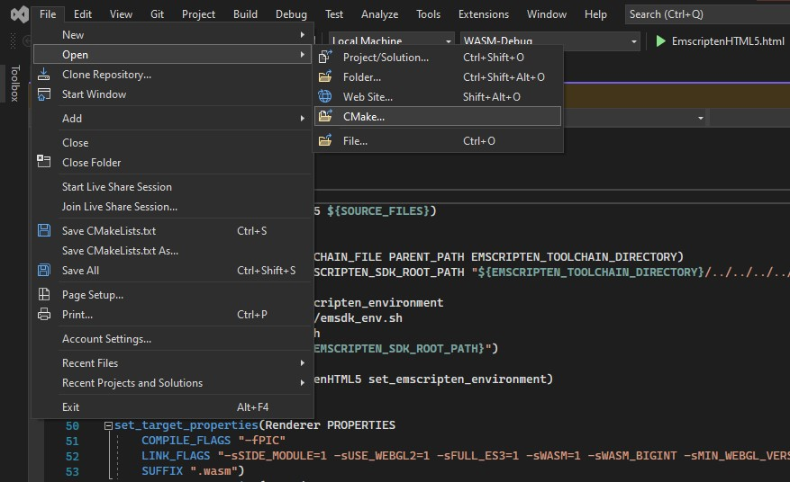

# GPU With C-Sharp Angular WASM
### C++ to WASM without GLFW

In this app, we get rid of GLFW and replace it with HTML5 function calls provided in emscriptens header.
The only things that are different compared to EmscriptenGLFW are:
- Callbacks
	- No longer uses glfw events in favor of html ones 
	- Additional event that happens when mouse cursor is moved as there is no static function to obtain mouse position inside render loop.
- Window class
	- Obtains html object with id `canvas`
	- Sets the canvas context as webgl's current
	- Assigns html callbacks to static methods/functions
	- Resizes html cavas to desired dimensions

Overall, this is really similiar to using JS to initalize a WebGL/WebGL2 context, with the addition of making it work for static GL function calls.

<br>

# Installation
<br>

### Emscripten

Set up Emscripten as explained in readme in directory above

<br>

### CMake

Launch VS2022 and use the newly added option to open a CMake project by targetting this CMakeLists.txt




<br>

## Building

In solution explorer on the top click on a button to switch between solutions and available views, then on CMake Target views and right click on EmscriptenHTML5 project to bring up a context menu that has an option to build. 
Another option is to change the launch target to `EmscriptenHTML5.html`, and then build by pressing `Ctrl + B`

<br>

-----

# Launching

Launch using ```python run.py ./EmscriptenHTML5/```

