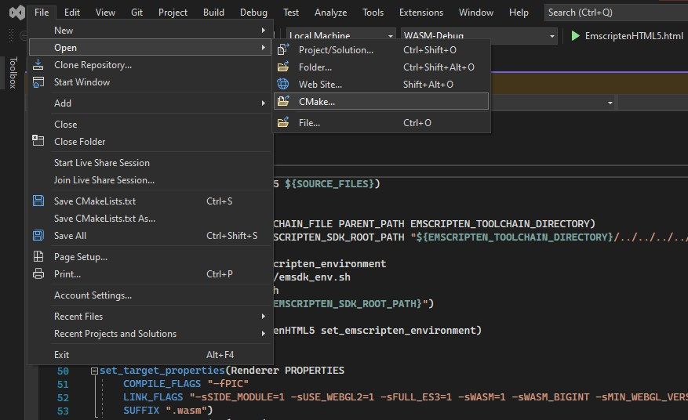

# GPU With C-Sharp Angular WASM
### C++ to WASM Split into Libraries


In this app variant, we look into what would happen if a part of the code was placed in a separate module and then linked to the main module.

The idea is to have a C++ renderer library that handles drawing a scene to an already active gl context, linked to a C# app with exposed C# bindings. The goal is to have a code that does allow linking as is, without altering C++ code, to see if it's possible to use the backend for rendering written in high-performance C++ within C# apps, as well as see if any debug information is lost during linking. 

Notice

In Emscripten’s case, code is typically going to run on the web. That means the following:

- The application is running in a sandbox. It has no local system libraries to dynamically link to; it must ship its own system library code.

- Code size is a major concern, as the application’s code is being downloaded over the internet, which is many orders of magnitude slower than an installed native app on one’s local machine.

For that reason, Emscripten automatically handles system libraries for you and automatically does dead code elimination etc. to do the best possible job it can at getting them small.

We decided to split the Renderer class, as it does not depend on other files in the app and is only responsible for GL calls and filesystem access (now done using wget).
Any further references to *lib* in this section will be referring to the WASM module compiled from Renderer.cpp.

Firstly, while creating a lib with Emscripten, we have to specify it does not have an entry point with `--no-entry` flag and during compilation with emcc.
Then link it to the app other module that has an entry point by using either static or dynamic linking.
(If we do not use `--no-entry` but `main` is not present, the compiler will suggest to use it.)

In the case of our app, we are interested in static linking and dynamic linking.

<br>

#### Static linking

The static linking process is pretty straight forward.
We need a library - a relocatable file - and a main app - also a relocatable file, and link the two together using a linker program such as `wasm-ld` 

Compiling C++ code to a relocatable file is the same as with gcc/clang: with -c or -r flag. 
``` 
emcc a.cpp -c -o a.o 
emcc b.cpp -c -o b.o 
emcc a.o b.o -o index.html 
```
Static linking proved to be invaluable, as both C# compiled with Blazor to WebAssembly and C++ with emcc compile to the same intermediate language - **Binaryen**. That, with the fact our module is a relocatable file allows us to statically link C++ to C#. This is covered more extensively in the next phases documentation. As for C++ static linking to C++ it works as usual.

A problem arises when we utilize the option to separate the DWARF debug information from the relocatable module. If we do that, all debug info from the lib is lost. 

<br>

#### Dynamic linking

When considering dynamic linking, we found out that the concept differs from the native dynamic linking. 
You build several separate code **modules** from your source code, and link them at runtime. The linking connects the undefined symbols in each module with the defined symbols in the others, in the simplest of ways. It does not currently support some corner cases.

There are two types of shared modules:

1. **Main modules**, which have system libraries linked in.

2. **Side modules**, which do not have system libraries linked in.
   
A project must contain **exactly one** main module.
The `renderer.cpp` became Emscripten's `SIDE_MODULE`, and the `main.cpp`, `window.cpp` and `callbacks.cpp` became `MAIN_MODULE`.

The one tricky aspect to this design is that a side module might depend on a system library that the main module did not depend on, such as OpenGL.


#### Loadtime dynamic linking

Load-time dynamic linking refers to the case when the side modules are loaded along with the main module, during startup and they are linked together before your application starts to run.


The lib will need to be compiled with additional options for this approach to work.
```
emcc Renderer.cpp -s SIDE_MODULE=1 -o lib.wasm 
emcc Window.cpp lib.wasm -s MAIN_MODULE=1 -o index.html
```

Benefits of side modules: They are downloaded and cached independently of the main module. If there are several main modules that use a common side module, the shared side module only has to be downloaded once, speeding up startup and reducing download overhead. There is no need for C interfaces when linking C++ to C++.

Debugging issue: Symbols that are not resolved do not cause any errors until code execution gets to invoke them. It makes diagnosing problems troublesome. Alas, the only solution is building in debug mode with -s ASSERTIONS=1 option, which gives better descriptions of missing symbols. 

What you dont need to be concerned about while using dynamic linking is losing debug symbols, even when separated using separate DWARF.

CMake hardships: In C++, there is a need to add a generated file as a dependency of the main module. More over, Emscripten's cmake module does not support shared libraries. Even when declaring 
`add_library(Renderer SHARED ${RENDERER_FILES})` using the official release of Emscripten will fall back to using `STATIC`.
[Github issue on this](https://github.com/emscripten-core/emscripten/issues/17804).


#### Runtime dynamic linking 

With the use of `dlopen()` function that is provided with Emscripten, it's possible to asynchronously load modules at runtime when they are needed.
Once they are loaded, then we have to explicitly resolve symbols using `dlsym()`.
You’ll never need to know what’s required ahead of time, and instead, you can programmatically decide what libraries are needed and when.
Of course, the libs will need to be downloaded during cold boot. It is possible to locate a timeframe where the download is idle during profiling, and schedule loading of libraries in that timeframe to optimize boot time the most for that one particular device, but for others results might vary depending on devices’ and their internet speeds.

As for usage, in our case we need to access a constructor for the `Renderer` class, as well as methods like `Renderer::render()` and a few others, to call them in the windowing module. 
That, however, proves to be difficult for a few reasons.

Problem: 
- Symbol mangling. Much like in C#, C++ symbols used in classes get scrambled, making it hard to access symbols without interfaces written in C.
The problem with C interfaces for C++ code is that it requires an army of interns to provide maintenance. This affects even linking C++ to C++. One solution is to set up code generation to create static functions for these methods at build time.
- Deciding when to download the extra submodule for use on the web and not stalling the app is not easy. It's possible to do it in Javascript, in a C++, before WebAssembly instantiation, just before `dlopen()`. The complexity of the solution can vary greatly. Wrong usage will cause the app to halt and wait for module to download and link.
    
We concluded that runtime dynamic linking of wasm modules is not suitable.


<br>

# Installation
<br>

### Emscripten

Set up Emscripten as explained in readme in directory above.
Due to emscripten not supporting CMake's SHARED libraries, there needs to be a temporary workaround done in order to truly create a shared lib, instead of falling back to STATIC.
Navigate to `emsdk\upstream\emscripten\cmake\Modules\Platform`, and edit line #21 

```
set_property(GLOBAL PROPERTY TARGET_SUPPORTS_SHARED_LIBS FALSE)
```

to 

```
set_property(GLOBAL PROPERTY TARGET_SUPPORTS_SHARED_LIBS TRUE)
```

This solution might cause problems, and there already is a pull request that tackles shared library support. You can replace `emsdk\upstream\emscripten` with ax31's branch
`git clone git@github.com:ax3l/emscripten.git -b cmake-toolkit-side-module-shared`


<br>

### CMake

Launch VS2022 and use the newly added option to open a CMake project by targetting this CMakeLists.txt



To use static linking, either do not alter `emsdk\upstream\emscripten` at all, or if you did change CMakeLists.txt in the project from
```
add_library(Renderer SHARED
	${RENDERER_FILES}
) 
```
to
```
add_library(Renderer STATIC
	${RENDERER_FILES}
) 
```

<br>

## Building

In solution explorer on the top click on a button to switch between solutions and available views, then on CMake Target views and right click on EmscriptenHTML5 project to bring up a context menu that has an option to build. 
Another option is to change the launch target to `EmscriptenHTML5.html`, and then build by pressing `Ctrl + B`

<br>


## Launching

Launch using ```python run.py ./EmscriptenHTML5SeparateLibs/```

<br>


## Debugging 

To debug the app, you need 
- Enabled DWARF in experimental chrome settings
- Installed DWARF extension for C++
- Built app in Debug configuration running on a server.	

Go to sources, place a breakpoint in JS. You can step into function calls until you reach C++.

You can add a FileSystem directory to the sources workspace, and place a breakpoint in C++ source code directly.

If you compile the lib with separate dwarf and statically link it to the main module, you will not be able to view lib source during debugging.

<br><br><br><br><br>

Notes:
-------

Both the executable (the main module) and the library (side module) need to be compiled with position independent code

Use `-gsplit-dwarf -gseparate-dwarf=EmscriptenHTML5.dbg.wasm` to significantly decrease the size of the wasm file built in debug.

Do not use `-fdebug-compilation-dir` ever despite what was shown on some youtube tutorials by google.

