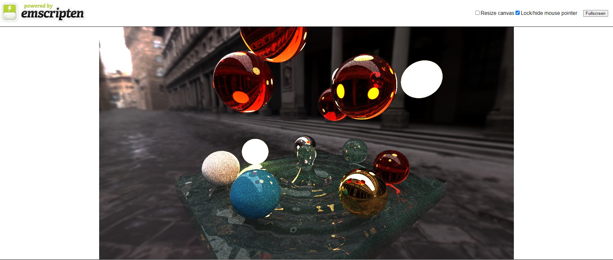
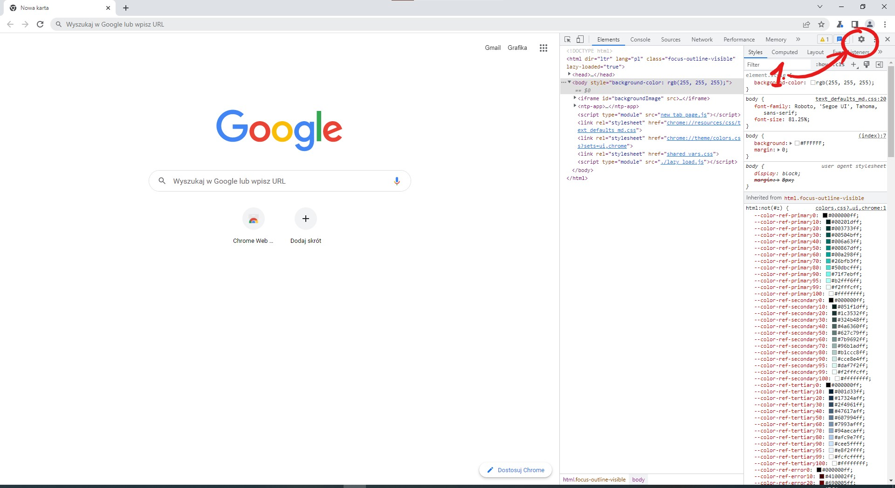
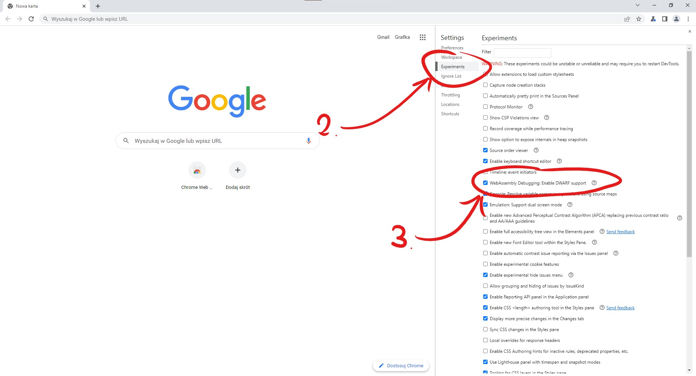

# GPU-With-C-Sharp-Angular-WASM



We developed a  proof of concept of a WebAssembly application to answer the question:

## Is it possible to mix languages such as C# and C++ on the web with the current tools?

----------------------------

## TL;DR Yes it is possible but you'll never escape C++

Basically bindings to WebGL (likewise for WebGPU) and any other WebAPI usually accessible from JavaScript are absent from WebAssembly and are provided by Emscripten's curated mix of C and C++ headers with JavaScript glue code in its library.

If you need a refresher or an explanation why that is the case, please refer to our detailed explanation here:<br>
https://github.com/Devsh-Graphics-Programming/JS-WASM-interop-benchmark#how-the-browser-wasm-runtime-works-and-its-limits

Any further C# bindings you might use would simply be nice wrappers around a set of P/Invokes into Emscripten's WASM main module or JS library.

### Are there any alternatives to WASM, short of rewriting your C++ or C# codebase to TypeScript or JavaScript?

Not really, unless you count Emscripten's `asm.js` which cross compiles C++ to JavaScript as an option, which is bound to get far less attention and maintenance going forward than the WASM backend.

#### PRO: Only WASM will give you support for a true 64bit target (8 byte pointers, eventually)

JavaScript does not have a native 64bit integer type, while WASM has the `memory64` WASM proposal.

For now Emscripten has the `sMEMORY64=2` option which will emulate 64bit by casting 32bit WASM memory addresses, which is harmless since upper half of the address is always zero.

**This makes it significantly easier and less stressful to port existing C++ and C# codebases which may have made assumptions about 64bit architecture being targetted**.

#### PRO: Eventually the amount of JavaScript glue code emitted by Emscripten will shrink

This is because:
1. Most C-APIs (like `malloc`) were already implemented in JavaScript for `asm.js` and work perfectly, so a C implementation compiled WASM will happen eventually but is low priority
2. [Direct WebAPI calls from WASM are being considered, but are delayed due to contingency on WASM being JavaScript Garbage Collector aware](https://github.com/WebAssembly/spec/issues/1221#issuecomment-671549664)
3. [JS to C/C++ function call overheads are small, but not negligible, so there's an incentive to cull them](https://github.com/Devsh-Graphics-Programming/JS-WASM-interop-benchmark#c-and-c-function-invocation-overheads)

#### CON: The only reason to avoid WASM is to be able to reclaim memory

The WASM browser runtime can only grow a single WASM Module's heaps, it can't release memory back to the OS, this is both because of security and because of WASM virtual machine's unified address space which apparently has no virtualization.

[As discussed here](https://github.com/WebAssembly/design/issues/1397) it could be a problem for applications that experience very large memory spikes.

#### CON: WASM DWARF Debug Symbols save absolute paths to sourcecode (only affects C/C++)

This makes debug builds non-portable across machines, we even tried "patching" DWARFs by finding and modiying file paths in the binary file. However the DWARF format is offset based, so changing the length of the path was not an option, while padding the strings with null characters messed with concatenation.

The solution is to find or develop some DWARF editing script or library that lets us modify these files properly.

_We'd like to highlight that Android NDK is also plagued by a similar issue of not being able to debug a C++ project on a machine that has not built it, so we consider this a minor nuisance._

### Downsides of using any C# as opposed to pure C++

#### Blazor and Mono-WASM are buggy, compromise on performance and are missing features

See the issues we've opened during our development:
- Lack of documentation of available features https://github.com/dotnet/aspnetcore/issues/42850
- Probable lack of Native-style threading support https://github.com/dotnet/aspnetcore/issues/42851
- The way Blazor uses Emscripten is shabby https://github.com/dotnet/runtime/issues/75257 https://github.com/dotnet/runtime/issues/75345
- performance regression in C# to JS argument passing speed https://github.com/dotnet/aspnetcore/issues/38510
- Abysmal JS to C# argument passing speed, function call and memory usage overhead https://github.com/dotnet/aspnetcore/issues/44088

#### Being forced into the Razor pages bloat

There's no standalone Mono-WASM toolchain for producing "simple" WASM+JS Libraries for later linkage, as you would desire, if you didn't want Blazor to be in charge of your website layout or UI framework.

In order to extract your C# code AOT compiled into a `dotnet.wasm` and `dotnet.js` for later usage you have to produce a full Blazor website with `wwwroot`, CSS, `index.html`, etc. as well as publish it, as AOT is only performed upon publish. Until then your C# code stays as a DLL to be interpreted by the runtime.

In reality, because of the need to launch and debug the code from VS2022, you would be copying your entire website (any JS or TS) to `wwwroot` to facilitate 1-click launch and debug.

Futhermore this means that there can only be one C# WASM module, you cannot have separate C# `DLL`s which can be linked into a single WASM main module. You could in theory use multiple separate WASM main modules in a single JS script, but whether the JS glue code accompanying each main module won't complain is a separate issue. 

#### Blazor or Mono-WASM toolchain scripts for adding `NativeFileReference`s break dynamic linking of WASM sidemodules

Dynamic Linking of WASM modules is useful for decreasing waiting time for page load and only fetching the modules that are needed to perform a task.

Also this would allow us to compile C++ or C WASM modules with an Emscripten version of our choice rather than the one that is shipped with Blazor, which would help to work around Blazor toolchain issues [such as the compiler hanging if its not ran as Admin](https://github.com/dotnet/runtime/issues/75345).

#### VS2022 provides no single Debugger that can deal with a mixed C#, C++/C, TypeScript and JavaScript callstack

Naturally as the Chrome Dev Tools Debugger is oblivious to the .Net Runtime it has no information about C# functions and variables, even when the program was built with AoT. However with the DWARF debugging extension it can offer a C++ and C debugging experience on par with any IDE's debugger, with the additional bonus of being able to debug a mixed JavaScript and DWARF stack.

The VS2022 Debugger for Emscripten Targets supports mixed language callstacks with watches, breakpoints, etc. if the correct DWARF extensions and options are enabled in the Chrome instance it connects to. However this does not get used when debugging a Blazor Target project.

The Blazor Target debugger only supports mixes stacks of C#, TypeScript and JavaScript, where any part of the callstack in C or C++ shows up as pure unannotated WASM.

This leads to an awkward situation where VS2022 has two debuggers that can debug C++ and JS or C# and JS but not both at the same time, which is mildly annoying.

The solution is to have the Chrome Dev Tools Debugger open simultaneously in the chrome tab started by the VS2022 Debugger, which works most of the time but can interfere with each other with regards to breakpoint hitting and stepping.

----------------------------

## Project and Report Structure

This repository contains our findings on the intricacies of having each language compiled compiling, debugging to WebAssembly and maintaining its codebase. 

Each variant renders the ame interactive pathtraced scene using the same shader code. The source for `./data/shader.frag` is [stochastic pathtracer v1 on shadertoy](https://www.shadertoy.com/view/4ddcRn). Minor adapatations were made to run it outside of ShaderToy.


### Application Controls

 - Use `1, 2, 3, 4, 5` on the alphanumerical keyboard to switch background.
 - The fifth background is a cubemap, that can be toggled between two variants by repeatedly pressing the `5` key.
 - Click and drag with the mouse butons mouse on screen to change the position of a camera.

The apps were created in this order (CI deployed builds on GH static pages are hyperlinked):
1. Native
2. [EmscriptenGLFW](https://devsh-graphics-programming.github.io/GPU-With-C-Sharp-Angular-WASM/EmscriptenGLFW/build/WASM-Release/EmscriptenGLFW.html)
3. [EmscriptenHTML5](https://devsh-graphics-programming.github.io/GPU-With-C-Sharp-Angular-WASM/EmscriptenGLFW/build/WASM-Release/EmscriptenHTML5.html)
4. EmscriptenHTML5SeparateLibs
5. NativeCSharp
6. [BlazorEmscripten](https://devsh-graphics-programming.github.io/GPU-With-C-Sharp-Angular-WASM/BlazorEmscripten)
7. [TBD] Emscripten in AngularJS
  
And thus the notes are a followup of the previous chapters.

----------------------------

## Set-up

### Required Tools

#### Git

Need a command line client with a configured SSH key for GitHub (otherwise you cannot checkout submodules recursively).

#### Visual Studio 2022

Install the following Visual Studio 2022 workloads:
- Desktop Development with C++
- ASP.Net and WebDevelopment 

And components:
- Emscripten Build Target
- .NET WebAssembly build tools

#### Chrome WASM C/C++ Devtools Extension

You wil need an extension for Chrome to be able to debug C++ code with dwarf debug symbols.

The DWARF format contains source mapping to files on a local machine that compiled the app (absolute filepaths). It allows placing breakpoints and watches in source code as well as inspecting unmangled local variables. 

https://chrome.google.com/webstore/detail/cc%20%20-devtools-support-dwa/pdcpmagijalfljmkmjngeonclgbbannb

_Note: Other debug symbol formats and compile options do not work as well, and will result in missing function and variable names as WASM simply enumerates all symbols and uses their indexes in place of names. This is why you need DWARF._

#### Emscripten (TODO: Remove, make all targets use VS2022 solutions)

*EmscriptenGLFW, EmscriptenHTML5, EmscriptenHTML5SeparateLibs*

Instead of the standard C++ and C# compiler, the apps in this repository use Emscripten.

To install, clone the repository somewhere on your machine:

```
git clone https://github.com/emscripten-core/emsdk.git

cd emsdk
```

Run the following emsdk commands to get the latest tools from GitHub and set them as active:
```
# Download and install the latest SDK tools.
./emsdk install latest

# Make the "latest" SDK "active" for the current user. (writes .emscripten file)
./emsdk activate latest --permanent

# Activate PATH and other environment variables in the current terminal
source ./emsdk_env.sh
```

Instruction on how to install Emscripten can be found on the [official site](https://emscripten.org/docs/getting_started/downloads.html).

Then, add an extra environment variable **EMSCRIPTEN**  with value `path-to-emsdk/upstream/emscripten`. We use i

Once thats done and all the environment variables are assigned *(with --permament option)* you can proceed.

Despite this, Blazor Wasm will clone its own fork of `git@github.com:emscripten-core/emscripten.git` to `C:\Program Files\dotnet\packs\Microsoft.NET.Runtime.Emscripten.2.0.23.Sdk.win-x64\6.0.4\tools\emscripten\` and be adamant on using that to compile the C++ portions of *BlazorEmscripten* hybrid app.

#### SWIG (TODO: Remove, just add swigwin binary to 3rdparty and don't add it to PATH)

*BlazorEmscripten only*

Hybrid apps require a language bridge. We use SWIG to generate platform invokes and native class equvalents in C# (and C-API function wrappers) for C++ public methods and fields in the C++ part of the app.

Go to [SWIG download page](https://www.swig.org/download.html) and get the latest **swigwin** version (swigwin contains swig.exe and allows us to skip building on windows).

Extract the zip archive.

Add the extracted dir to PATH. 

### Obtain source

Clone this repository recursively (needed for dependency submodules).

```
git clone https://github.com/Devsh-Graphics-Programming/GPU-With-C-Sharp-Angular-WASM.git --recurse-submodules 
```

### Configuring and Building

Simply open each example's `.sln` file in their folder and build.

TODO: Change all targets to use Visual Studio solutions instead of CMake.

Before the TODO is done, for details check each example's Readme

### Running

Can be ran using the Visual Studio's Debug option (TODO: remove `run.py`).

Otherwise a webserver like the one provied by emrun need to be started with the correct root directory equal to the repository root and one needs to manually navigate to the example build's `index.html`.

Caveats:
- The examples use a fragment shader located in a relative path at `../../data/shader.frag`
- Similarly, ithey uses cube maps located in a relative path `../../data/env/`
Therefore, carelessly moving the exectuable, `.js` or `.html` will break the app.

### CPU Debugging

Debugging WASM with watches, breakpoints and original variable and function names is only possible on Chromium-based browsers.

C/C++ can be debugged either via the built-in Chrome Developer Tools with the DWARF Extension, or using a tool which understands the Chrome Remote Debug Protocol and connects to an instance of Chrome which was started with the RDP listening port argument.

One of such tools is VS2022 itself when debugging Emscripten Target or Blazor Target projects.

#### C/C++ and JavaScript

The Chrome Developer Tools will show you JavaScript and WASM C/C++ function calls in a unified stack, you will be able to defined watches, place breakpoints and perform stepping in both languages.

You can also use VS2022 as the Debugger.

##### MAKE SURE TO ENABLE: The Chrome DWARF experimental option

In order for the aforementioned extension to work an extra option needs to be enabled in the browser:
1. Open Chrome,
2. Open Developer Tools (Ctrl + Shift + i) 
3. Open Options (F1)

4. Go to Experiments 
5. Enable WebAssembly Debugging: Enable DWARF Support


##### MAKE SURE TO ENABLE THIS OPTION ON THE DEFAULT SIGNED OUT PROFILE

We had an issue where VS2022 was starting its own instance of Chrome listening to a remote debug port, and this instance is started without a user being signed in. As a consequence a lot of time was spent chasing a "Blazor loses DWARF info when linking Native File Dependencies" phantom bug.

**!!! This means that if you downloaded and enabled the DWARF Debugging extension while signed into your own profile, you need to do it again from the Chrome instance that Visual Studio starts when debugging !!!**

#### C#, TypeScript and Java Script

You need to use the VS2022 Debugger, otherwise you will only be able to debug JS code as the C# will show up as a bunch of unannotated WASM.

Unfortunately the Blazor Target debugger does not incorporate the Emscripten Target debugger so if you want to debug C++ you need to do it from within Chrome itself (make sure to enable DWARF debugging).

We presume the reason is that the VS2022 Emscripten debugger is built off the existing Visual C++ Debugger to remote Linux GDB bridge, as we've found an existing project of a GDB to CRD bridge used for chaining to Visual Studio's GDB. Meanwhile the VS2022 Blazor debugger seems to be an extended TypeScript Debugger.

### GPU Debugging with RenderDoc (TODO: explain everything)

TODO

----------------------------

# License

See License.md

